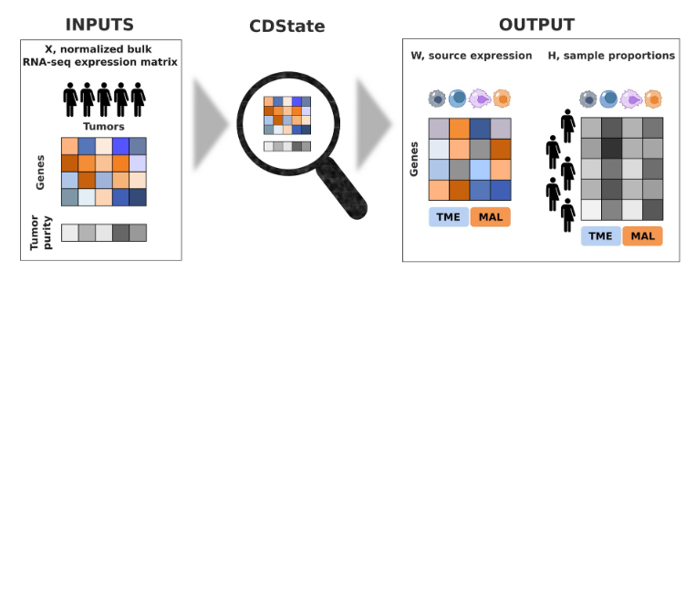

# CDState
### An unsupervised approach to predict malignant cell heterogeneity in tumor bulk RNA-sequencing data

[](https://doi.org/10.1101/2025.03.01.641017) &nbsp;
[](https://github.com/BoevaLab/CDState/wiki)



<br/>

CDState is an unsupervised deconvolution method for tumor bulk RNA-sequencing data, aimed at identifying malignant cell states and their proportions.

## Installation with Conda

1. Clone the repository:
   ```bash
   git clone https://github.com/BoevaLab/CDState.git
   cd CDState
   ```

2. Create the Conda environment:
   ```bash
   conda env create -f environment.yml
   ```

3. Activate the environment:
   ```bash
   conda activate cdstate
   ```

4. Verify Python version:
   ```bash
   python --version # should be Python 3.10.x
   ```


## Basic usage

Input bulk data should have genes in rows, samples in columns.

Input purity should have a column 'purity', with samples in rows.


```python
import CDState_base as cd
import pandas as pd
import copy
import numpy as np

data = pd.read_csv("data/bulkified_mixes/mixa_bulk_sum.csv", index_col=0,sep=',',header=0)
proportions = pd.read_csv("data/bulkified_mixes/seta_bulk_sum.csv", index_col=0,sep=',',header=0)

purity = proportions.loc[:,'Malignant']
purity.rename(index="purity", inplace=True)
purity.index = data.columns
```
1. Create CDState object:
```python
k = 3 # number of sources
cn = cd.CDState(data, num_bases=k, global_round = False)
```
2. Prepare data - filter out genes from sex chromosomes and keep only highly variable genes for deconvolution:
```python
cn.prepare_data() 
```
3. Initialize sources as random k samples from `cn.data` after gene filtering:
```python
n_cols = cn.data.shape[1]
cols = np.random.choice(n_cols, size=k, replace=False)
initial_sources = cn.data[:, cols]
cn.W = copy.copy(initial_sources)
cn.W += 1e-10 # add pseudocount to avoid division by 0
```

4. Run Step 1:
```python
cn.factorize()
```

5. Run Step 2:
```python
cnG = cd.CDState(data, purity, num_bases=k, global_round = True, gene_list = cn.gene_list)
cnG.H = copy.copy(cn.H) # start from proportions found in Step 1
cnG.W = copy.copy(cn.W) # start from sources found in Step 1
cnG.prepare_data()
cnG.factorize()
```
6. (Optional) Recover source expression for filtered-out genes:
```python
cnG.infer_full()
```

## Outputs

CDState returns following outputs:
- outputs from Step 1 are stored in `cn`, outputs from Step 2 are stored in `cnG`
- `cn.H` and `cnG.H`: numpy array with inferred source proportions [sources x number of samples]
- `cn.W` and `cnG.W`: numpy array with inferred source expression [filtered genes x sources]
- `cn.W` and `cnG.W`: numpy array with inferred source expression [filtered genes x sources]
- `cn.full_W` and `cnG.full_W`: pandas data frame with source expression inferred for all genes from `data` [genes x sources]
- `cn.gene_list` and `cnG.gene_list`: list of genes used for deconvolution
- `cnG.mal` : column indexes of malignant (`malignant = cnG.W[:,cnG.mal]`)

## Input parameters:
CDState uses the following parameters that can be adjusted by a user:

| Parameter | Description |
|------|-------------|
| `data` | pandas data frame with bulk RNA-seq expression [genes x samples]|
| `purity` | pandas data frame with purity values for input samples, index should be called 'purity'|
| `num_bases` |Number of sources for deconvolution (default: 4)|
| `global_round` | if False, CDState runs Step 1, otherwise runs Step 2 (default: False)|
| `l1` and `l2` | Weights used to prioritize reconstruction error and cosine similarity in Step 2 (default: l1=1, l2=0)|
| `threshold_low` and `threshold_high` | quantiles for gene filtering (keeps genes between the two values) (default: threshold_low = 0.3, threshold_high = 0.99)|
| `gene_list` | input gene list to be used for deconvolution (instead of CDState internal gene filtering) (default: None)|

## Tutorials

Jupyter notebooks with tutorials on how to run CDState, select number of components and characterize output sources can be found in `notebooks`.
For method overview please see our [Wiki](https://github.com/BoevaLab/CDState/wiki).

## Data

Bulkified data used for CDState benchmarking can be found in `data`:
- `bulkified_cancer` contains five datasets: breast cancer [Wu et al.](https://doi.org/10.1038/s41588-021-00911-1), ovarian cancer [Vázquez-García et al.](https://doi.org/10.1038/s41586-022-05496-1), glioblastoma [Neftel et al.](https://doi.org/10.1016/j.cell.2019.06.024), lung cancer [Kim et al.](https://doi.org/10.1038/s41467-020-16164-1), squamous cell carcinoma [Ji et al.](https://doi.org/10.1016/j.cell.2020.05.039).
- `bulkified_mixes` contains four simulated mixes generated using lung cancer data [Kim et al.](https://doi.org/10.1038/s41467-020-16164-1)

For details check `README` inside the two directories.

## TCGA malignant cell states

CDState malignant sources and proportions identified across The Cancer Genome Atlas bulk RNA-seq data can be found in `TCGA_states`. For details check `README` inside the directory.

## Citing CDState
If you use CDState in your work, you can cite it using
```BibTex
@article {Kraft2025.03.01.641017,
	author = {Kraft, Agnieszka and Yates, Josephine and Barkmann, Florian and Boeva, Valentina},
	title = {CDState: an unsupervised approach to predict malignant cell heterogeneity in tumor bulk RNA-sequencing data},
	elocation-id = {2025.03.01.641017},
	year = {2025},
	doi = {10.1101/2025.03.01.641017},
	publisher = {Cold Spring Harbor Laboratory},
	URL = {https://www.biorxiv.org/content/early/2025/04/09/2025.03.01.641017},
	eprint = {https://www.biorxiv.org/content/early/2025/04/09/2025.03.01.641017.full.pdf},
	journal = {bioRxiv}
}
```

## License
CDState is licensed under the MIT License. See the `LICENSE` file for details.
