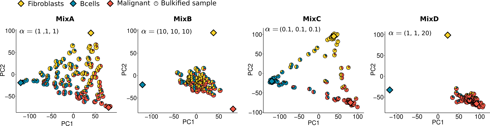

# Bulkified mixes

To validate CDState performance in datasets with heterogenous composition, we generated four in silico mixes using single-cell lung cancer data described by [Kim et al.](https://doi.org/10.1038/s41467-020-16164-1).

We selected malignant cells, B cells and fibroblasts, which were bulkified based on proportions drawn from Dirichlet distribution with four different sets of concentration parameters, where θi represents cell type proportions for sample i:

1. Mix A: θi ∼ Dir(1,1,1), generating dataset with pure and heterogenous samples,
2. Mix B: θi ∼ Dir(10,10,10), generating samples of high heterogeneity, and overall average proportions of all 3 cell types,
3. Mix C: θi ∼ Dir(0.1,0 .1,0.1), generating pure samples for respective cell types,
4. Mix D: θi ∼ Dir (1,20,1), generating samples with high proportion of malignant cells and very low proportion of B cells and fibroblasts.

For each mix we generated 100 samples.

Cells of specific cell types were samples from the pool of all cells within the single-cell dataset and aggregated based on the respective proportions. After aggregation per sample, the expression values were normalized by the total read count. Ground-truth sources were generated by aggregating all cells used for bulkification per cell type.

### Description of files:
- `mixa_bulk_sum.csv`, `mixb_bulk_sum.csv`, `mixc_bulk_sum.csv`, `mixd_bulk_sum.csv` : bulkified expression [genes x samples]
- `seta_bulk_sum.csv`, `setb_bulk_sum.csv`, `setc_bulk_sum.csv`, `setd_bulk_sum.csv` : cell type proportions of the bulkified samples [samples x cell types]
- `mixa_sources_sum.csv`, `mixb_sources_sum.csv`, `mixc_sources_sum.csv`, `mixd_sources_sum.csv` : ground-truth gene expression of cell types [genes x cell types].

